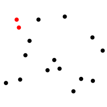
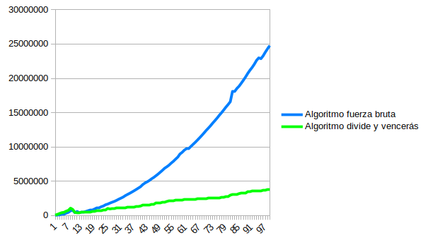
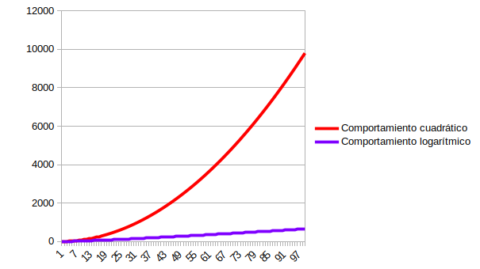

# Algoritmo del par más cercano

- Alejadro David Carillo Padrón
- Aduanich Rodríguez Rodríguez
- Daniel Darias Sánchez  

20/3/2017  

## Problema a resolver
El problema del par más cercano consiste en, dado n puntos sobre un espacio euclídeo, encontrar aquellos dos cuya distancia entre sí sea menor que cualquiera de las otras distancias entre cualesquiera puntos. Para nuestro caso, hemos trabajado con el caso bidimensional al tratarse del más intuitivo de resolver. De esta forma, considerando la siguiente nube de puntos:

se debe de encontrar los dos puntos destacados en color rojo. Esto es:

$$ p1, p2 \in Problema : \sqrt{| p1_{x} - p2_{x} |^2 + p1_{y} - p2_{y} |^2 } = min $$

## Técnicas empleadas
Se han empleado dos aproximaciones diferentes para resolver este problema, a saber
**fuerza bruta** y **divide y vencerás**. La utilización de ambas técnicas en este trabajo tiene su justificación en poder establecer comparativas entre las mismas y no obtener únicamente medidas "_descontextualizadas_" del algoritmo tipo divide y vencerás.

- #### Fuerza Bruta
  Tal y como su nombre indica, se trata de uan forma de abordar el problema basada puramente en la potencia de cálculo, empleando algorítmos de presumible escasa calidad y órdenes de complejidad altos.

- #### Divide y Vencerás
  Consiste en tratar de subdividr el problema en subproblemas de menor tamaño hasta llegar a un caso trivial, que puede ser resuelto directamente. Una vez conseguido esto, el proceso se invierte y se van combinando las soluciones a estos subproblemas hasta obtener la solución final.

## Explicación de los algoritmos
- #### Fuerza Bruta
  Tratar de comparar _todas_ las distancias entre _todos_ los puntos del problema de la siguiente forma:

  1. Consideramos todos los puntos del problema como elementos contenidos en un conjunto $V$
  2. Considerar $dmin$ como la distancia máxima posible en el plano
  2. Para cada elemento $e \in V$, comparar su distancia $d$ con el resto de elementos de $V$. Si esta distancia es menor a $dmin$, $dmin = d$
  3. Devolver $dmin$

- #### Divide y Vencerás  
  Trata de dividir el plano "x" veces hasta que queden pares de nodos y compara su distancia buscando un mínimo. Esto a priori puede resultar algo simple pero se complica al tener en cuenta que a la hora de dividir el plano, pares de nodos pueden quedar separados en distintas secciones impidiendo comprobar la distancia entre estos puntos. La manera de resolver esto consiste en establecer una zona de análisis en torno al punto en el que se divide el plano y analizar los puntos comprendidos dentro. Esta zona tiene un tamaño equivalente a la distancia mínima entre nodos obtenida hasta el momento ([-distMin, distMin]). En caso de cumplirse que algún par de puntos tiene menor distancia que la mínima obtenida hasta el momento, se sustituye este valor con el obtenido y continúa el algoritmo hasta haber acabado con cada división hecha en durante la ejecución del mismo.

## Pseudo código
- #### Fuerza Bruta

      minDist ← infinity
      for i = 1 to length(P) - 1
        for j = i + 1 to length(P)          
          if dist(P[i], P[j]) < minDist:
            minDist ← dist(P[i], P[j])
            closestPair ← (p, q)
          endif
        endfor
      enfor
      return closestPair

- #### Divide y Vencerás  

      closestPair of (xP, yP)           
        N ← length(xP)
        if N ≤ 3 then
          return closest points of xP using brute-force algorithm
        else
          xL ← points of xP from 1 to ⌈N/2⌉
          xR ← points of xP from ⌈N/2⌉+1 to N
          xm ← xP(⌈N/2⌉)x
          yL ← { p ∈ yP : px ≤ xm }
          yR ← { p ∈ yP : px > xm }
          (dL, pairL) ← closestPair of (xL, yL)
          (dR, pairR) ← closestPair of (xR, yR)          
          if dL < dR then
            (dmin, pairMin) ← (dL, pairL)
          else
            (dmin, pairMin) ← (dR, pairR)
          endif
          yS ← { p ∈ yP : |xm - px| < dmin }
          nS ← number of points in yS
          (closest, closestPair) ← (dmin, pairMin)
          for i from 1 to nS - 1
            k ← i + 1
            while k ≤ nS and yS(k)y - yS(i)y < dmin
              if |yS(k) - yS(i)| < closest then
                (closest, closestPair) ← (|yS(k) - yS(i)|, {yS(k), yS(i)})
              endif
              k ← k + 1
            endwhile
          endfor
          return closest, closestPair
        endif

## Complejidades

## Comprobación experimental

### Representación gráfica

## Conclusiones

## Apéndice
El `makefile` es capaz de generar dos programas diferentes en función del argumento que se le indique

- `make all` : genera un programa que calcula el par más cercano con ambos algoritmos una sola vez
- `make tests` : genera un programa para la realización de tests sobre ambos algoritmos

## Bibliografía
- http://www.cs.mcgill.ca/~cs251/ClosestPair/ClosestPairDQ.html
- https://es.wikipedia.org/wiki/Problema_del_par_de_puntos_m%C3%A1s_cercanos
- http://rosettacode.org/wiki/Closest-pair_problem#C.2B.2B
